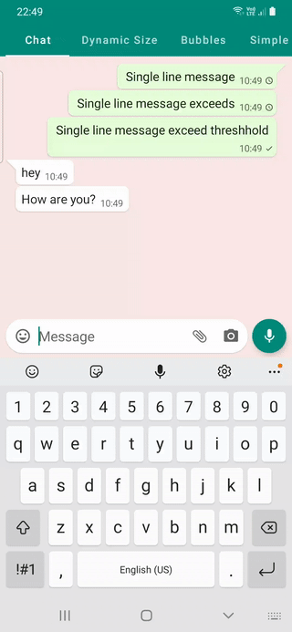
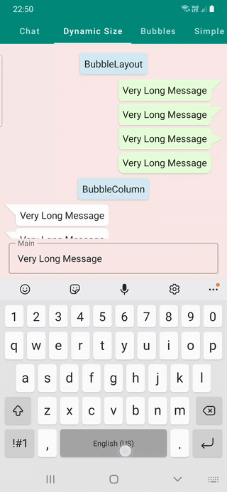
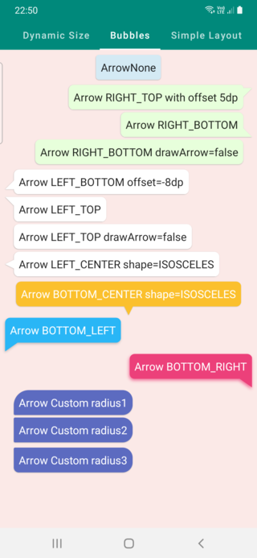

### Jetpack Compose Speech Chat Bubble

[](https://jitpack.io/#SmartToolFactory/Compose-Bubble)


Chat/Speech bubble width different arrow, background, shadow properties to create chat bubbles
like whatsapp, telegram or other messaging apps have or arrows with arrow at bottom to create
info bubble.

## Gradle Setup

To get a Git project into your build:

* Step 1. Add the JitPack repository to your build file Add it in your root build.gradle at the end
  of repositories:

```
allprojects {
  repositories {
      ...
      maven { url 'https://jitpack.io' }
  }
}
```

* Step 2. Add the dependency

```
dependencies {
	  implementation 'com.github.SmartToolFactory:Compose-Bubble:Tag'
}
```

`Modifier.bubble`, or createBubbleShape function to create this as `Shape` or `BubbleLayout` as in demo such as

```kotlin
@Composable
fun BubbleLayout(
    modifier: Modifier = Modifier,
    bubbleState: BubbleState,
    backgroundColor: Color = Color.White,
    shadow: BubbleShadow? = null,
    borderStroke: BorderStroke? = null,
    content: @Composable () -> Unit
) {
    Column(
        modifier.bubble(
            bubbleState = bubbleState,
            color = backgroundColor,
            shadow = shadow,
            borderStroke = borderStroke
        )
    ) {
        content()
    }
}

```


https://github.com/SmartToolFactory/Compose-Bubble/assets/35650605/f6bdd5fe-bb4f-4725-bd22-2696d29079bc


There are 4 demos to test **bubbles**.
* `DemoFullChat` is small chatting sample which displays arrow on first message from sender or user
* `DemoDynamicSize` is for changing bubbles dynamically to observe changes in real time. You can add your custom bubbles to test dynamic changes.
* `DemoBubbles` displays some sample bubbles
* `DemoSimpleLayout` is for demonstrating `Constraints.offset(x,y)` and `Contrainsts.constrainWidth` on `Layout` and `Placeable`

| Full Chat                           z    | Dynamic Size                                | Bubble Samples                              |
|------------------------------------------|---------------------------------------------|---------------------------------------------|
|  |  |  |


## BubbleState
```
class BubbleState internal constructor(
    var backgroundColor: Color = DefaultBubbleColor,
    var cornerRadius: BubbleCornerRadius = BubbleCornerRadius(
        topLeft = 8.dp,
        topRight = 8.dp,
        bottomLeft = 8.dp,
        bottomRight = 8.dp,
    ),
    var alignment: ArrowAlignment = ArrowAlignment.NONE,
    var arrowShape: ArrowShape = ArrowShape.TRIANGLE_RIGHT,
    var arrowOffsetX: Dp = 0.dp,
    var arrowOffsetY: Dp = 0.dp,
    var arrowWidth: Dp = 14.dp,
    var arrowHeight: Dp = 14.dp,
    var arrowRadius: Dp = 0.dp,
    var drawArrow: Boolean = true,
    var shadow: BubbleShadow? = null,
) 
```

to create a BubbleState to modify bubble to be drawn use one of the overloads of remember functions
```
fun rememberBubbleState(
backgroundColor: Color = DefaultBubbleColor,
cornerRadius: Dp = 8.dp,
alignment: ArrowAlignment = ArrowAlignment.NONE,
arrowShape: ArrowShape = ArrowShape.TRIANGLE_RIGHT,
arrowOffsetX: Dp = 0.dp,
arrowOffsetY: Dp = 0.dp,
arrowWidth: Dp = 14.dp,
arrowHeight: Dp = 14.dp,
arrowRadius: Dp = 0.dp,
drawArrow: Boolean = true,
shadow: BubbleShadow? = null,
)
```
### Properties
* **backgroundColor**: color of Bubble
* **cornerRadius**: Constructs a Radius for each side of bubble rectangle
* **alignment**: Arrow alignment determines in which side of the bubble this arrow should be drawn. When ArrowAlignment.NONE is selected no arrow is drawn.
* **arrowShape**: Shape of the arrow, It can be right or isosceles triangle or curved shape
* **arrowOffsetX**: Vertical offset for arrow that is positioned on top or at the bottom of the bubble. Positive values move arrow right while negative values move left. Arrow position is limited between left of content and  content right minus arrow width.
* **arrowOffsetY**: Vertical offset for arrow that is positioned on left or right side of the bubble. Positive values move arrow bottom while negative values move up. Arrow position  is limited between top of content and  content bottom minus arrow height.
* **arrowWidth**: width of the arrow
* **arrowHeight**: height of the arrow
* **arrowRadius**: radius of the arrow curves the tip of the arrow
* **drawArrow**: whether we should draw arrow or only have rectangle shape bubble
* **shadow**: of the arrow contains elevation, dx, dy, radius and color to draw shadow below bubble

### Usage

